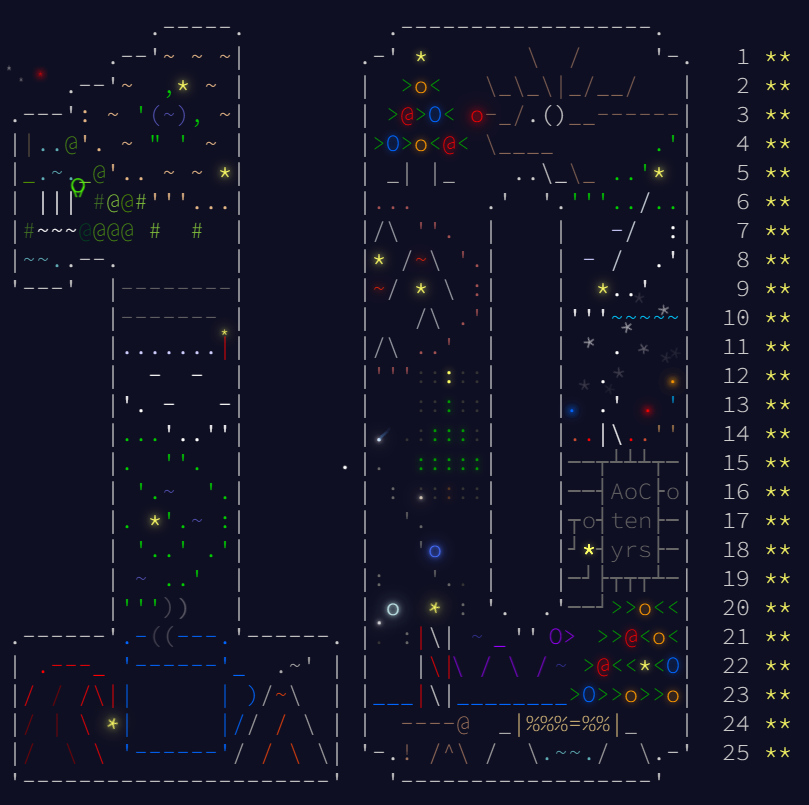

# Advent of Code 2024

These are my solutions to all 50 stars in the 2024 edition of the Advent of Code! These are all in C++ without the use of any external libraries (other than bits/stdc++.h) and with input parsing as is.

I have also commented every file with notes describing the solutions. If you found this helpful, please do consider starring the repo!